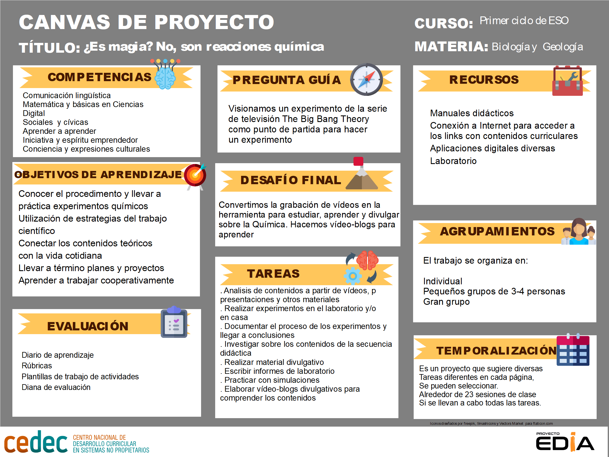

{}
Esta actividad es una adaptación del recurso original [***¿Es magia? No, son reacciones químicas***](https://cedec.intef.es/creamos-videoblogs-para-aprender-y-difundir-la-ciencia/), del [Proyecto EDIA de Cedec](https://cedec.intef.es).
{}

Esta actividad plantea al alumnado el desafío de generar un recurso audiovisual sobre reacciones químicas con vídeos de experimentos de laboratorio grabados y editados por él mismo. La creación de este producto final se completará con actividades en las que los estudiantes, trabajando en equipo, generarán sus propios materiales de estudio.

## Actividades iniciales: sorprender, motivar y organizar

Las [**actividades iniciales**](https://descargas.intef.es/cedec/proyectoedia/fisica_quimica/contenidos/es_magia/vaya_sorpresa.html) del proyecto consiguen que el alumnado:

- Sienta curiosidad hacia el contenido que va a trabajar (las reacciones químicas).
- Sea consciente de la importancia en su vida del tema que va a trabajar.
- Se convenza de que puede realizar experimentos químicos y dar a conocer los resultados de estos experimentos.

Este episodio de la conocida serie [***The Big Bang Theory***](https://es.wikipedia.org/wiki/The_Big_Bang_Theory) sirve como arranque del proyecto:



, a partir del cual el alumnado realiza su primer experimento y descubre, de manera rápida y divertida, la necesidad (y la oportunidad) de aprender Química.

Como último paso del apartado introductorio, se plantea al alumnado el proyecto que va a desarrollar: [un videoblog sobre Química](https://descargas.intef.es/cedec/proyectoedia/fisica_quimica/contenidos/es_magia/vdeos_para_divulgar_la_ciencia.html), organizándose en equipos de trabajo que grabarán los experimentos de laboratorio para después difundirlos. Cada grupo creará su propia recopilación de vídeos y todo el alumnado elegirá el mejor videoblog, que será propuesto para representar al instituto.

## Tareas de desarrollo: aprender, producir y difundir

En cada tarea se repasan conceptos e ideas básicas que son aplicadas después en experiencias de laboratorio llevadas a cabo por equipos de alumnos/as. Cada grupo grabará vídeos de todos los experimentos. Estos vídeos serán los que formarán parte del videoblog del grupo.

Las tareas implican actividades para organizar, resumir y difundir lo aprendido:

- Una exposición oral sobre los [cambios físicos y químicos](https://descargas.intef.es/cedec/proyectoedia/fisica_quimica/contenidos/es_magia/cambios_fsicos__y__qumicos.html).
- Un informe sobre la [corrosión](https://descargas.intef.es/cedec/proyectoedia/fisica_quimica/contenidos/es_magia/qu_ocurre_en_una_reaccin_qumica.html) con propuestas para combatirla.
- Un póster digital para [clasificar las reacciones químicas](https://descargas.intef.es/cedec/proyectoedia/fisica_quimica/contenidos/es_magia/tipos_de_reacciones_qumicas.html).
- Un artículo sobre la figura del científico [Lavoisier](https://descargas.intef.es/cedec/proyectoedia/fisica_quimica/contenidos/es_magia/ley_de_lavoisier.html).
- Una presentación de diapositivas con [ejemplos cotidianos de reacciones químicas](https://descargas.intef.es/cedec/proyectoedia/fisica_quimica/contenidos/es_magia/cmo_se_escriben_las_ecuaciones_qumicas.html).
- Un debate sobre los [beneficios y perjuicios de la industria química](https://descargas.intef.es/cedec/proyectoedia/fisica_quimica/contenidos/es_magia/cmo_afectan_las_reacciones_qumicas_a_nuestro_entorno.html).

## Tarea final: reacciones químicas en primera persona y en formato multimedia

La edición y recopilación de todas las grabaciones de los experimentos es el producto/objetivo final del proyecto. En la [**tarea final**](https://descargas.intef.es/cedec/proyectoedia/fisica_quimica/contenidos/es_magia/recopilamos_y_publicamos_nuestro_trabajo.html), cada grupo tendrá que revisar todos los vídeos producidos, editarlos y subirlos a su propio canal.

Este trabajo permitirá al alumnado no solo repasar todo lo aprendido sino también pensar en la mejor manera de transmitirlo a sus compañeros/as. Por eso, todos los equipos tendrán que hacer una presentación de su videoblog en la que el resto de grupos podrá plantear dudas y sugerencias.

Al acabar este proyecto, el grupo clase dispone de una colección de recursos que ayudan a organizar y aprender todos los contenidos trabajados. Además, son el medio para resumir y difundir el trabajo que el alumnado ha hecho para culminar el proyecto de aula.

## Guía didáctica

Este recurso educativo se plantea como una [**aventura didáctica**](https://descargas.intef.es/cedec/proyectoedia/fisica_quimica/contenidos/es_magia/_gua_didctica_.html) donde el alumnado tiene que investigar qué diferencia a un cambio químico de un cambio físico, cómo se producen las reacciones químicas, qué tipos de reacciones existen, cómo se representan las reacciones químicas, cómo se interpreta la ley de conservación de la masa, y cómo repercuten las reacciones químicas en nuestro entorno.

El proyecto que se plantea es la creación de un **videoblog científico** en el que incluirán las grabaciones de los experimentos hechos en cada tarea.

El proyecto está organizado en **tareas**, en las cuales se realizan actividades individuales y en equipo. El planteamiento es que toda la clase, organizada en grupos, trabaje todas las tareas, actividades y experimentos.

Se utilizarán el aula ordinaria y el aula laboratorio.