{}
En esta entrada transcribimos, con su permiso, la información que comparte [**Rodrigo González Peinado**](https://twitter.com/rodrigogpeinado) en estos tres magníficos hilos:







{}

{}

## Astronomía

### 1️⃣ Las fases lunares son consecuencia de las posiciones relativas entre Sol, Tierra y Luna

Así, la Luna es iluminada de diferente manera desde nuestra posición a medida que completa su órbita en torno a la Tierra, lo que genera dichas fases.

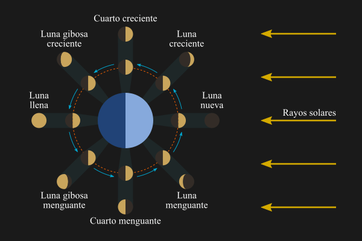

### 2️⃣ La sucesión de estaciones se debe a la inclinación del eje de rotación de la Tierra

Esto hace que la cantidad de energía solar recibida en cada hemisferio varíe a medida que la Tierra completa su órbita alrededor del Sol.

### 3️⃣ El movimiento de la bóveda celeste es debido a la rotación terrestre

Como nosotros rotamos con la Tierra, nos da la sensación de que son los astros los que se desplazan de este a oeste. Es solo una cuestión de sistema de referencia.



### 4️⃣ Los (otros) movimientos de la Tierra

Si bien la rotación y traslación terrestres son los más importantes en nuestro día a día, la Tierra también posee otros movimientos, siendo el de [precesión](https://es.wikipedia.org/wiki/Precesión_de_los_equinoccios) el más importante de ellos.

")

### 5️⃣ Las constelaciones no se descubren, se inventan

Las [constelaciones]() no son objetos per se, sino construcciones que hemos realizado los humanos en la bóveda celeste para dividir el firmamento.

### 6️⃣ Las estrellas están a diferentes distancias de nosotros

Pese a que parezcan estar todas "pegadas" en la bóveda celeste, algunas están más lejos que otras, aunque las agrupemos en la misma constelación.

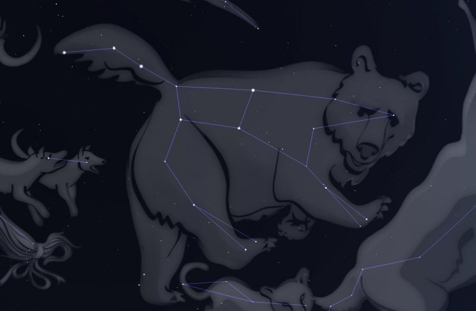

### 7️⃣ Todas las estrellas que vemos en el firmamento pertenecen a la Vía Láctea

Además, tan solo observamos las más cercanas al Sol, la gran mayoría en un radio inferior a 2&thinsp;000 años luz. Pensad en esto cada vez que miréis al firmamento.

.png")

### 8️⃣ El "Camino de Santiago" es nuestra galaxia

Ese gran arco blanquecino que atraviesa el firmamento es la visión que tenemos de nuestra galaxia, la [Vía Láctea](https://es.wikipedia.org/wiki/Vía_Láctea), desde su interior.

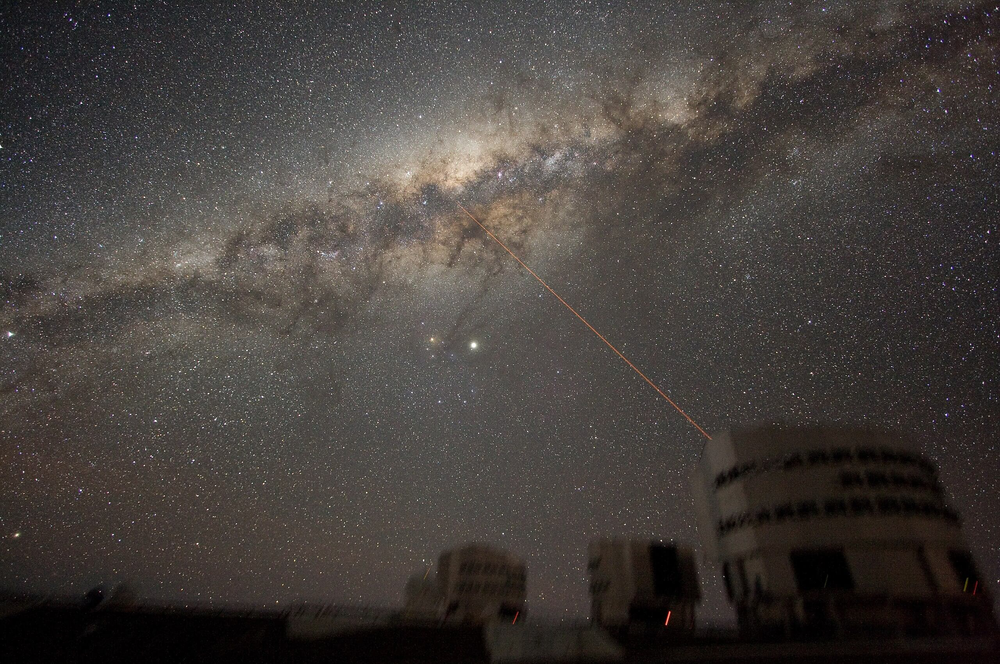

### 9️⃣ Existen miles de millones de galaxias, cada una de ellas con miles de millones de estrellas

Nos situamos en una galaxia espiral más, de las muchas que existen, con todas las implicaciones que eso conlleva. ¿Y si... 👽?

.jpg")

### 1️⃣0️⃣ La confusión entre astronomía y astrología

La [astronomía](https://es.wikipedia.org/wiki/Astronomía) es la ciencia que se encarga de estudiar la posición, movimiento y brillo de los astros. La [astrología](https://es.wikipedia.org/wiki/Astrología) es la [pseudociencia](https://es.wikipedia.org/wiki/Pseudociencia). Fin.

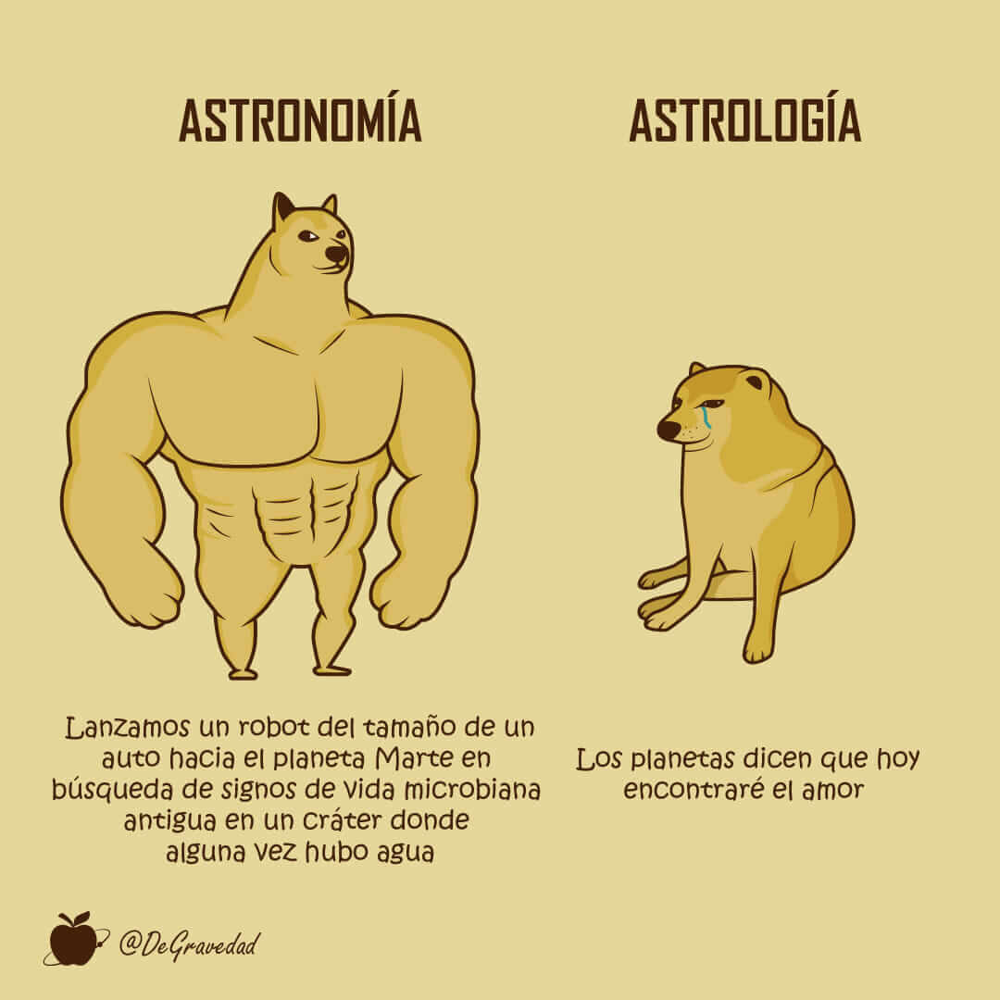

## Astrofísica

### 1️⃣ Siempre observamos el pasado de los astros

Independientemente de lo cerca o lejos que esté un objeto de nosotros, siempre vemos su pasado. Esto se debe a que la luz necesita de un tiempo en recorrer una determinada distancia.

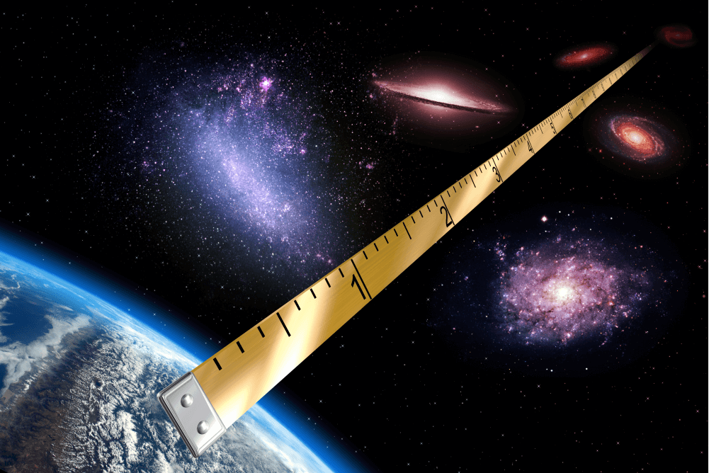

### 2️⃣ La luz visible es solo una ínfima porción de la radiación que podemos observar

Estudiar los astros en diferentes longitudes de onda ([rayos X](https://es.wikipedia.org/wiki/Rayos_X), [microondas](https://es.wikipedia.org/wiki/Microondas)...) nos aporta una visión mucho más completa y rica sobre los mismos: temperatura, composición...

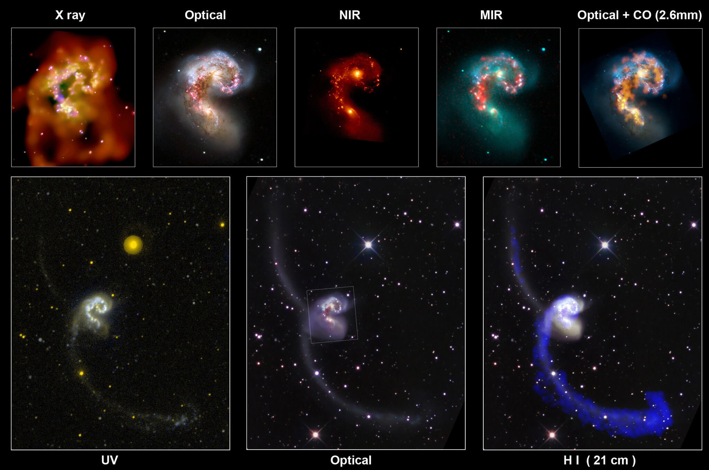

### 3️⃣ Las estrellas son grandes esferas de plasma en rotación que generan energía mediante reacciones nucleares de fusión

El hidrógeno es el elemento más abundante en ellas seguido del helio y, en menor medida, otros elementos llamados "metales".

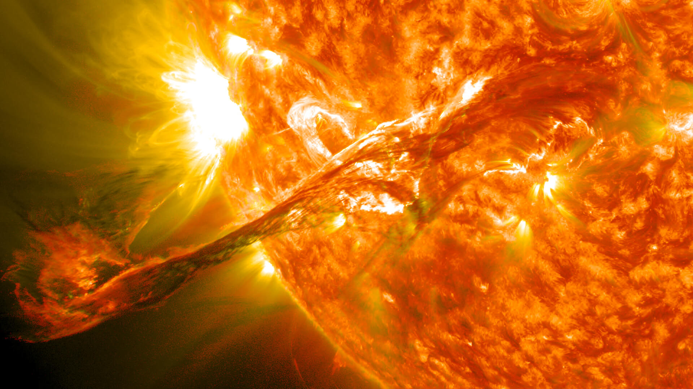

### 4️⃣ El Sol es una estrella normal y corriente

Nuestra estrella (en la esquina inferior izquierda de la imagen) no es ni de las más calientes ni de las más grandes que existen. Al contrario, es más bien fría y pequeña, como muchas que se han descubierto.

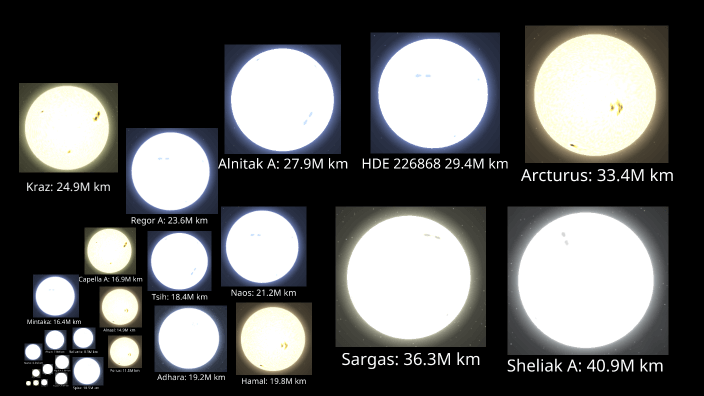

### 5️⃣ El sistema solar se formó del colapso gravitatorio de una nube de gas y polvo

De hecho, es el modelo estándar de formación de sistemas planetarios. La formación de nuestro sistema debe ser compatible con las observaciones de otros sistemas.



### 6️⃣ El color de las estrellas depende de su temperatura superficial

Las estrellas frías presentan colores rojizos y naranjas, mientras que las calientes tienden a azules. Justo al revés que los grifos de las casas.

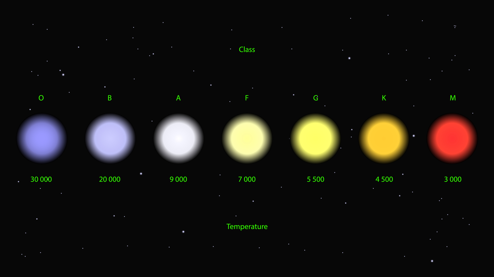

### 7️⃣ La vida de una estrella depende de su masa inicial

Estrellas muy masivas evolucionan rápidamente y viven poco tiempo hasta explotar en forma de supernovas, mientras que las más ligeras se van consumiendo más lentamente.

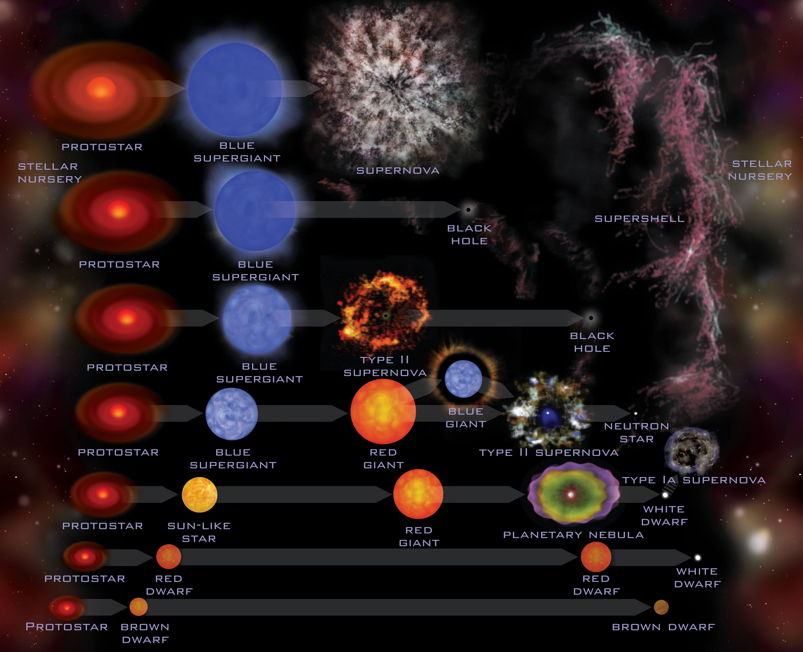

### 8️⃣ La mayoría de estrellas son invisibles a nuestros ojos

Se denominan enanas rojas y forman casi el 75&thinsp;% de estrellas en la [Vía Láctea](https://es.wikipedia.org/wiki/Vía_Láctea). Son tan pequeñas y frías que su brillo es imperceptible por el ojo humano.

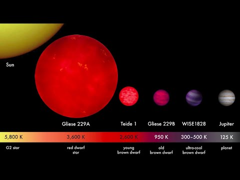

### 9️⃣ Somos polvo de estrellas

La gran mayoría de los elementos químicos de los que estamos hechos se forman en procesos que involucran a las estrellas. Esta es sin duda la mayor aportación de la [astrofísica](https://es.wikipedia.org/wiki/Astrofísica) a la humanidad.

### 1️⃣0️⃣ La importancia de la espectroscopía

Nada de esta entrada ni de la [astrofísica](https://es.wikipedia.org/wiki/Astrofísica) sería posible sin la [espectroscopía](https://es.wikipedia.org/wiki/Espectroscopia). Esta técnica nos permite obtener la huella propia de cada astro, su espectro, y gracias a él, muchísima información.

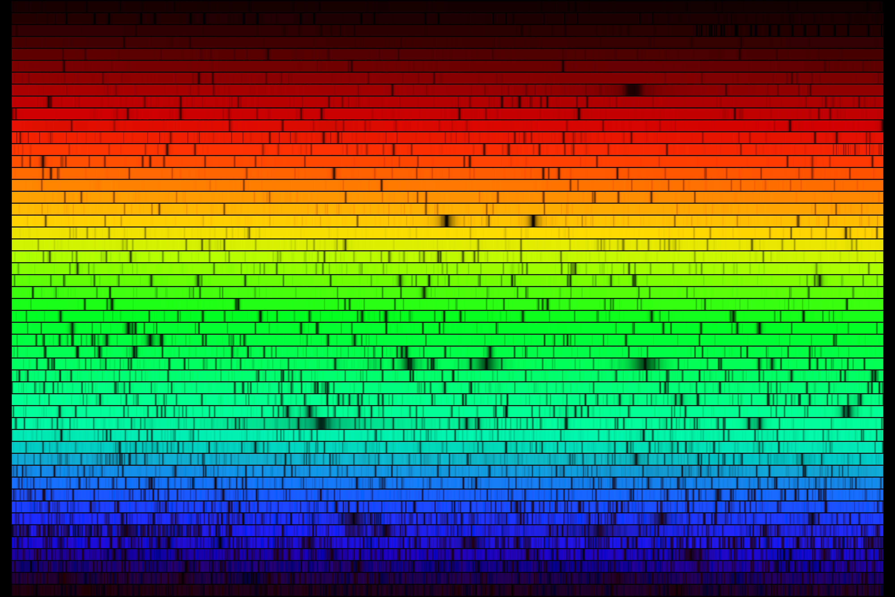

## Cosmología

### 1️⃣ Las galaxias, su dinámica y distancia son los objetos primarios de estudio de la cosmología

Se agrupan formando [cúmulos](https://es.wikipedia.org/wiki/Agrupación_galáctica), [supercúmulos](https://es.wikipedia.org/wiki/Supercúmulo) y [filamentos galácticos](https://es.wikipedia.org/wiki/Filamento_galáctico) y [vacíos cósmicos](https://es.wikipedia.org/wiki/Vacío_(astronomía)), conformando la estructura a gran escala del universo.

.jpg")

### 2️⃣ Cuando hablamos de universo, lo hacemos (casi) siempre del universo observable

Es decir, la región del universo centrada en nosotros de la cual nos llega radiación y podemos estudiar. Inferimos que el universo total es mucho mayor que el [universo observable](https://es.wikipedia.org/wiki/Universo_observable).

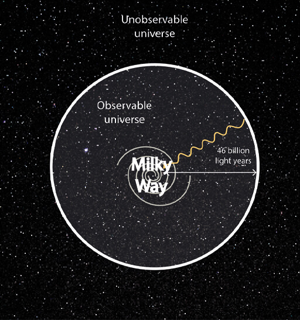

### 3️⃣ Las medidas de distancias a galaxias lejanas son fundamentales en cosmología

Para ello se utilizan, entre otras, las llamadas [candelas estándar](https://es.wikipedia.org/wiki/Candela_estándar), eventos u objetos de gran luminosidad a partir de las cuales se establece una [escalera de distancias cósmicas](https://es.wikipedia.org/wiki/Escalera_de_distancias_cósmicas).

### 4️⃣ A escalas lo suficientemente grandes, consideramos al universo como homogéneo e isótropo

Esto significa, en pocas palabras, que no existe un punto privilegiado sobre otros ni un centro. Es lo que se conoce como el [principio cosmológico](https://es.wikipedia.org/wiki/Principio_cosmológico).

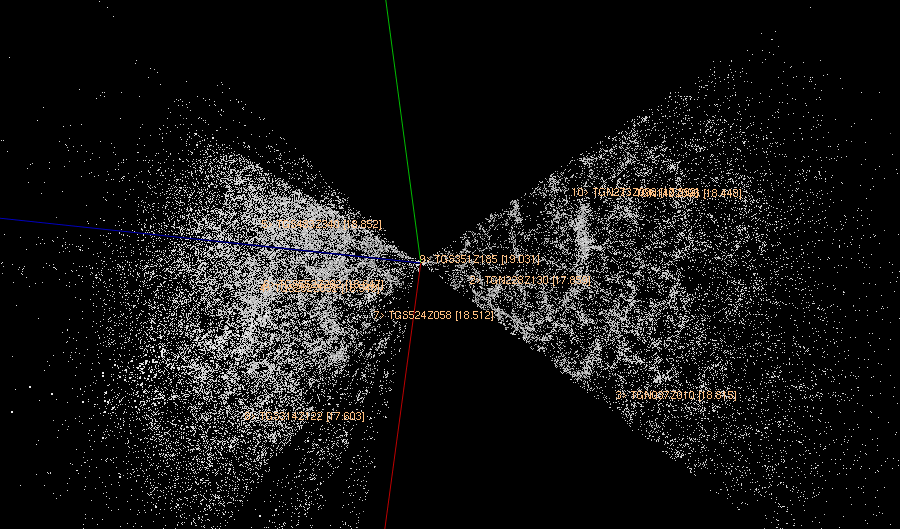

### 5️⃣ A distancias cosmológicas, el universo se expande, es decir, el espacio entre galaxias aumenta

Esto indica que en el pasado las galaxias estaban todas más cerca unas de otras. Además, desde 1998 sabemos que [esta expansión es acelerada](https://es.wikipedia.org/wiki/Expansión_acelerada_del_universo).

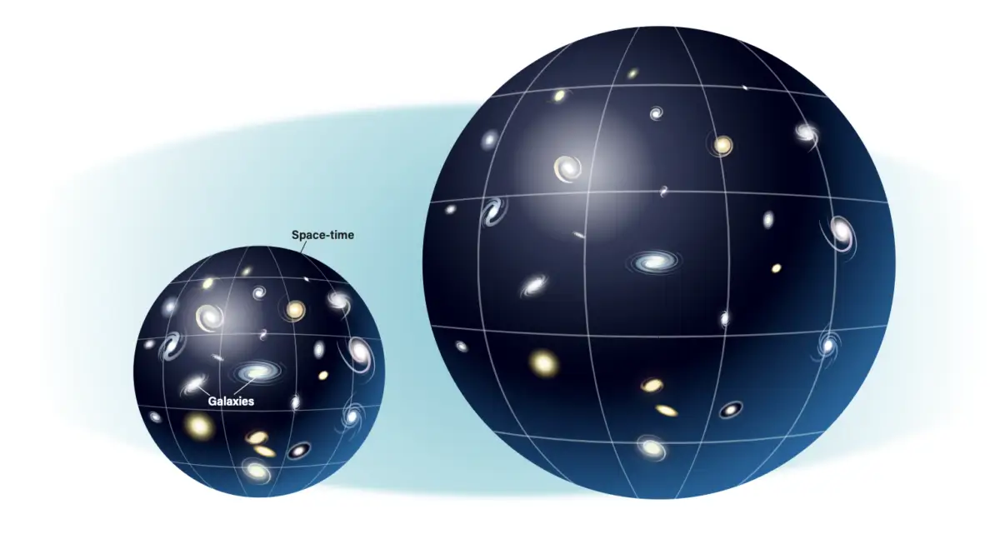

### 6️⃣ La teoría del Big Bang es la teoría más aceptada actualmente sobre la evolución del universo

Desde un estado previo muy denso y caliente hace 13&thinsp;800 Ma hasta su configuración actual y su futuro. No tiene nada que ver con una gran explosión ni con su creación.



### 7️⃣ La radiación cósmica de microondas es la evidencia observacional más clara a favor de la teoría del Big Bang

Se trata de una radiación que permea todo el universo, liberada 380&thinsp;000 años tras el inicio de la expansión y que está relacionada con la formación de estructuras.

### 8️⃣ El modelo ΛCDM (Lambda-Cold Dark Matter) pone números a la teoría del Big Bang

Establece que el universo se compone de [energía](https://es.wikipedia.org/wiki/Energía_oscura) y [materia oscuras](https://es.wikipedia.org/wiki/Materia_oscura), [materia bariónica u ordinaria](https://es.wikipedia.org/wiki/Barión) y [radiación electromagnética](https://es.wikipedia.org/wiki/Radiación_electromagnética). Sus proporciones determinan la forma y evolución del universo.

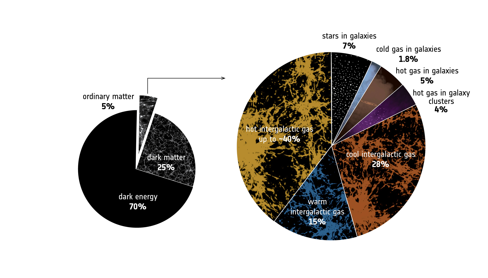

### 9️⃣ Energía y materia oscuras son conceptos diferentes

Mientras que la [materia oscura](https://es.wikipedia.org/wiki/Materia_oscura) explicaría algunas observaciones gravitatorias de origen desconocido, la [energía oscura](https://es.wikipedia.org/wiki/Energía_oscura) actuaría como una "antigravedad", responsable de la [expansión acelerada del universo](https://es.wikipedia.org/wiki/Expansión_acelerada_del_universo).

### 1️⃣0️⃣ Según el modelo ΛCDM, la materia que nos constituye (bariónica) es tan solo el 4&thinsp;% del contenido total de materia-energía del universo

El 96&thinsp;% restante está en forma de materia y energía oscuras, de las que desconocemos su naturaleza.

