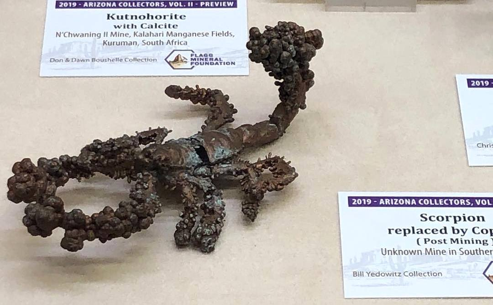

Tenemos al 99 % y al 99.9 % ¿Al 100 %? ¿Está seguro? ¿Si trae para pagar? Va a tardar un poquito.

El adjetivo "puro" en la vida cotidiana está relacionado con la idea de calidad, de saludable, de natural o de no contaminado. Alguien podría pensar que el jugo de naranja es una "sustancia pura" si proviene directamente de la naranja; actualmente, incluso podrían agregar: si proviene de una naranja orgánica es un jugo más puro. Así, cuando estás en el bosque, tal vez has pensado que estás respirando "aire puro".

En el área química, la pureza es una propiedad analítica y depende del método de análisis que se use. La pureza está asociada con la idea de que un material tiene varios componentes (sustancias); es decir, es una mezcla, y uno de ellos, el que da la pureza, es el de mayor interés (científico o económico), el resto de los componentes del material, los de menor interés, son nombrados como impurezas. Por ejemplo, la plata es mejor conductor de la electricidad que el cobre, entonces ¿por qué no se usa plata para los circuitos eléctricos de las casas o las industrias? Porque tiene un mayor valor económico y las instalaciones, así como su mantenimiento y reparaciones serían más costosos.

El cobre cuenta con algunas propiedades que lo hacen un buen candidato para su uso en el hogar y a nivel industrial: maleable, dúctil y con una alta conductividad, entre otras propiedades, hacen que el cobre sea la primera opción en todo el mundo para la transmisión de electricidad en incontables aplicaciones. Y para ello, se buscan diferentes niveles de pureza química.

No existe un material 100 % químicamente puro, pero una parte fundamental del análisis químico es cuantificar qué tan cercano o alejado del 100 % de pureza se encuentra un componente como parte de un material. Cada forma de presentar la concentración tiene su utilidad.

En la síntesis de medicamentos, alimentos y otros productos, la pureza es un requerimiento técnico. Obtener un material con alta pureza significa haber eliminado o retirado otros materiales, al separarlos del primero, del que deseamos "puro".

La pureza al 100 % de un material no sólo es un ideal experimental, sino además según el componente en estudio, a veces se hace lo necesario para separarlo del material; es decir, "purificar" ese material. En el caso de la purificación de cobre más que quitar, se agregan átomos de cobre.

Las "impurezas" habituales presentes en el cobre son hierro, plata, plomo, estaño, níquel y cobalto. El tipo y cantidad de "impurezas" dependen del mineral del cual se obtiene el cobre. Una mena es un mineral que contiene suficiente metal de interés como para que merezca la pena que ese metal sea extraído.

Existen más de 100 minerales que contienen cobre de los cuales menos de 20 tienen importancia como menas del metal. Las principales menas del cobre son: calcopirita, bornita y malaquita.

Las menas se encuentran enterradas en la corteza terrestre; así que, para obtener el metal se deben desarrollar tres fases principales: minería, extracción y purificación.

Las mayores reservas de cobre se encuentran en Chile, de ahí que sea el primer país productor de cobre del mundo, por delante de Perú y China.

[Según el US Geological Survey](https://pubs.usgs.gov/periodicals/mcs2021/mcs2021.pdf), en 2020 se produjeron en todo el mundo unos 20 millones de toneladas de cobre, lo que supone un pequeño descenso respecto al año anterior.

Una de las vías de tratamiento para la producción de cobre es la hidrometalurgia, compuesta por las siguientes etapas: disminución de tamaño del mineral, lixiviación, extracción por disolventes y electroobtención. El resultado final de estas etapas es la producción de cátodos de alta pureza.

El afino es un proceso metalúrgico de descarburización y eliminación de impurezas. Existe el afino electrolítico, proceso que se usa para afinar más del 80% de la producción mundial de cobre para obtenerlo en alta pureza.

Así que se usa cobre "impuro" al 99 % para obtener cobre "puro" o, mejor dicho, de alta pureza.

Las reacciones rédox del proceso de afino del cobre son:

Ánodo: Cu ⟷ Cu2+ + 2 e–; &emsp; <em>E</em>&#x26AC; = –0.337 V

Cátodo: Cu2+ + 2 e– ⟷ Cu; &emsp; <em>E</em>&#x26AC; = +0.337 V

Se producen otras reacciones de oxidación y reducción parciales en donde interviene el catión Cu+, las cuales se deben controlar. Se busca obtener cantidades industriales de cobre de alta pureza. Un ejemplo de esas otras reacciones rédox, es:

2 Cu+ + 2 H+ + ½ O2 ⟷ 2 Cu2+ + H2O &emsp; (oxidación al aire)

Los cátodos de cobre deben alcanzar una pureza mínima del 99.99 %, lo cual es la calidad empleada en varios procesos de transmisión de energía eléctrica.

Es decir, se "quitan" átomos de una muestra de cobre al 99 % para "dárselos" a otra muestra de cobre que se "purificará" hasta el 99.99 %.



Entonces... ¿Qué tan puro quiere su cobre, joven?